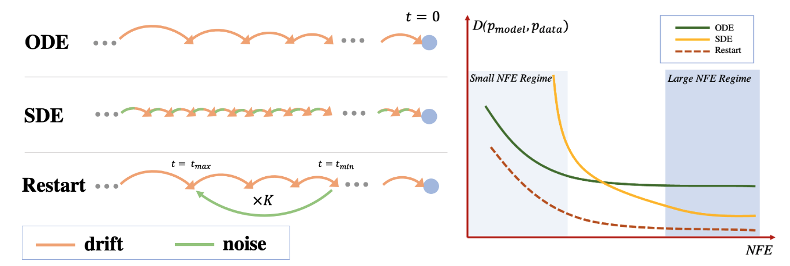
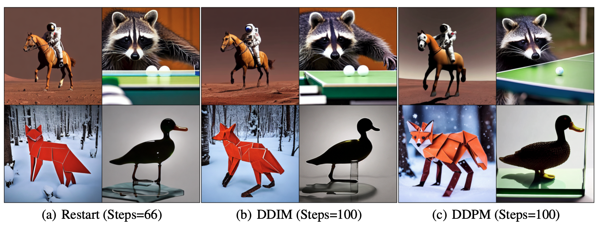
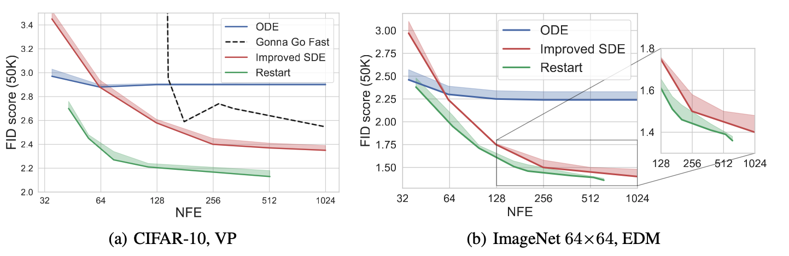
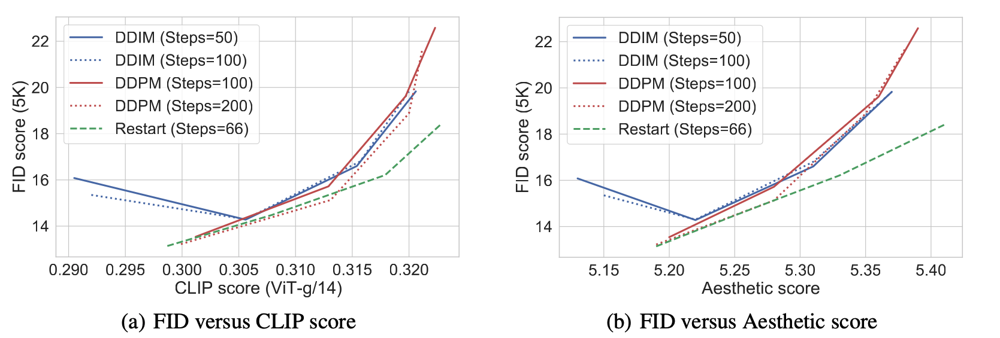

# Restart sampling

[Restart Sampling for Improving Generative Processes](https://arxiv.org/abs/2306.14878)

*by Yilun Xu, Mingyang Deng, Xiang Cheng, Yonglong Tian, Ziming Liu and Tommi S. Jaakkola*


Generative processes that involve solving differential equations, such as diffusion models, frequently necessitate balancing speed and quality. ODE-based samplers are fast but plateau in performance while SDE-based samplers deliver higher sample quality at the cost of increased sampling time.  We attribute this difference to sampling errors: ODE-samplers involve smaller discretization errors while stochasticity in SDE contracts accumulated errors. Based on these findings, **we propose a novel sampling algorithm called *Restart* in order to better balance discretization errors and contraction.** 

Empirically, **Restart sampler surpasses previous diffusion SDE and ODE samplers in both speed and accuracy**. Restart not only outperforms the previous best SDE results, but also accelerates the sampling speed by 10-fold / 2-fold on CIFAR-10 / ImageNet $64{\times} 64$. In addition, it attains significantly better sample quality than ODE samplers within comparable sampling times. Moreover, **Restart better balances text-image alignment/visual quality versus diversity** than previous samplers in the large-scale text-to-image **Stable Diffusion** model pre-trained on LAION $512{\times} 512$.




Results on [Stable Diffusion v1.5](https://github.com/huggingface/diffusers):



---


## Standard Benchmarks (CIFAR-10, ImageNet-64)

**The working directory for standard benchmarks is under `./benchmarks`**

#### 1. Preparing datasets and checkpoints

**CIFAR-10:** Download the [CIFAR-10 python version](https://www.cs.toronto.edu/~kriz/cifar.html) and convert to ZIP archive:

```.bash
python dataset_tool.py --source=downloads/cifar10/cifar-10-python.tar.gz \
    --dest=datasets/cifar10-32x32.zip
python fid.py ref --data=datasets/cifar10-32x32.zip --dest=fid-refs/cifar10-32x32.npz
```

**ImageNet:** Download the [ImageNet Object Localization Challenge](https://www.kaggle.com/competitions/imagenet-object-localization-challenge/data) and convert to ZIP archive at 64x64 resolution:

```.bash
python dataset_tool.py --source=downloads/imagenet/ILSVRC/Data/CLS-LOC/train \
    --dest=datasets/imagenet-64x64.zip --resolution=64x64 --transform=center-crop
python fid.py ref --data=datasets/imagenet-64x64.zip --dest=fid-refs/imagenet-64x64.npz
```

Alternatively, you could consider downloading the FID statistics at [CIFAR-10-FID](https://nvlabs-fi-cdn.nvidia.com/edm/fid-refs/cifar10-32x32.npz) and [ImageNet-$64\times 64$-FID](https://nvlabs-fi-cdn.nvidia.com/edm/fid-refs/imagenet-64x64.npz).


Please download the CIFAR-10 or ImageNet checkpoints from [EDM](https://github.com/NVlabs/edm) repo or [PFGM++](https://github.com/Newbeeer/pfgmpp) repo. For example,

| Dataset                | Method                          | Path                                                         |
| ---------------------- | ------------------------------- | ------------------------------------------------------------ |
| CIFAR-10               | VP unconditional                | [path](https://nvlabs-fi-cdn.nvidia.com/edm/pretrained/baseline/baseline-cifar10-32x32-uncond-vp.pkl) |
| CIFAR-10               | EDM unconditional               | [path](https://nvlabs-fi-cdn.nvidia.com/edm/pretrained/edm-cifar10-32x32-uncond-vp.pkl) |
| CIFAR-10               | PFGM++ ($D=2048$) unconditional | [path](https://drive.google.com/drive/folders/1sZ7vh7o8kuXfFjK8ROWXxtEZi8Srewgo) |
| ImageNet $64\times 64$ | EDM conditional                 | [path](https://nvlabs-fi-cdn.nvidia.com/edm/pretrained/edm-imagenet-64x64-cond-adm.pkl) |


#### 2. Generate

Generating a large number of images can be time-consuming; the workload can be distributed across multiple GPUs by launching the above command using `torchrun`. Before generation, please make sure the checkpoint is downloaded in the `./benchmarks/imgs` folder

```shell
torchrun --standalone --nproc_per_node=8 generate_restart.py --outdir=./imgs \
--restart_info='{restart_config}' --S_min=0.01 --S_max=1 --S_noise 1.003 \
--steps={steps} --seeds=00000-49999 --name={name} (--pfgmpp=1) (--aug_dim={D})


restart_config: configuration for Restart (details below)
steps: number of steps in the main backward process, default=18
name: name of experiments (for FID evaluation)
pfgmpp: flag for using PFGM++
D: augmented dimension in PFGM++
```

The `restart_info` is in the format of  $\lbrace i: [N_{\textrm{Restart},i}, K_i, t_{\textrm{min}, i}, t_{\textrm{max}, i}] \rbrace_{i=0}^{l-1}$ , such as `{"0": [3, 2, 0.06, 0.30]}`. Please refer to Table 3 (CIFAR-10) and Table5 (ImageNet-64) for detailed configuration. For example, on uncond. EDM cond. ImageNet-64, with NFE=203, FID=1.41, the command line is:

```shell
torchrun --standalone --nproc_per_node=8 generate_restart.py --outdir=./imgs \
--restart_info='{"0": [4, 1, 19.35, 40.79], "1": [4, 1, 1.09, 1.92], "2": [4, 5, 0.59, 1.09], "3": [4, 5, 0.30, 0.59], "4": [6, 6, 0.06, 0.30]}' --S_min=0.01 --S_max=1 --S_noise 1.003 \
--steps=36 --seeds=00000-49999 --name=imagenet_edm
```

We also provide the extentive Restart configurations in `params_cifar10_vp.txt`, `params_imagenet_edm.txt`, corresponding to Table 3 (CIFAR-10) and Table5 (ImageNet-64) respectively. Each line in these `txt` is in the form of $N_{\textrm{main}} \quad \lbrace i: [N_{\textrm{Restart},i}, K_i, t_{\textrm{min}, i}, t_{\textrm{max}, i}]\rbrace_{i=0}^{l-1}$. To sweep the Restart configurations in the `txt` files, please run

```shell
python3 hyperparams.py --dataset {dataset} --method {method}

dataset: cifar10 | imagenet
method: edm | vp | pfgmpp
```

The above sweeping will reproduce the results in the following figure (Fig 3 in the paper):



#### 3. Evaluation

For FID evaluation, please run:

```shell
python fid.py  ./imgs/imgs_{name} stats_path

name: name of experiments (specified in geneation command line)
stats_path: path to FID statistics, such as ./cifar10-32x32.npz or ./imagenet-64x64.npz
```

---


## Stable Diffusion

TODO: merge into the diffuser repo.


💡  Since we adopt the [huggingface/diffuser](https://github.com/huggingface/diffusers/tree/main) repo, we keep all their structure and files. But we only apply Restart sampler in the `/diffuser/diffusers/pipelines/stable_diffusion/pipeline_stable_diffusion.py` files. **More exact pointer is [Restart code block](https://github.com/Newbeeer/diffusion_restart_sampling/blob/b1e0022406e619cafb118a69b70a90484fb84c94/diffuser/diffusers/pipelines/stable_diffusion/pipeline_stable_diffusion.py#L676-L817)** in Stable diffusion.


**The working directory for standard benchmarks is under `./diffuser`**



#### 1. Data processing:

- Step 1: Follow the instruction on top of `data_process.py`
- Step 2: Run `python3 data_process.py` to randomly sampled 5K image-text pair from COCO validation set.

- Step 3: Calculate FID statistics `python fid_edm.py ref --data=path-to-coco-subset --dest=./coco.npz`

#### 2. Generate

```
torchrun --rdzv_endpoint=0.0.0.0:1201 --nproc_per_node=8 generate.py 
	--steps: number of sampling steps (default=50) 
	--scheduler: baseline method (DDIM | DDPM | Heun)
	--save_path: path to save images
	--w: classifier-guidance weight ({2,3,5,8})
	--name: name of experiments
	--restart
```

If you would like to visualize the images given prompt, run:

```python
python3 visualization.py --prompt {prompt} --w {w} --steps {steps} --scheduler {scheduler}  (--restart)

prompt: text prompt. defautlt='a photo of an astronaut riding a horse on mars'
steps: number of sampling steps (default=50) 
scheduler: baseline method (DDIM | DDPM)
w: classifier-guidance weight ({2,3,5,8})
```


#### 3. Evaluation

- FID score

  ```sh
  python3 fid.py {path} ./coco.npz
  
  path: path to the directory of generated image
  ```

- Aesthetic score & CLIP score

  ```shell
  python3 eval_clip_score.py --csv_path {path}/subset.csv --dir_path {path}
  
  path: path to the directory of generated image
  ```


